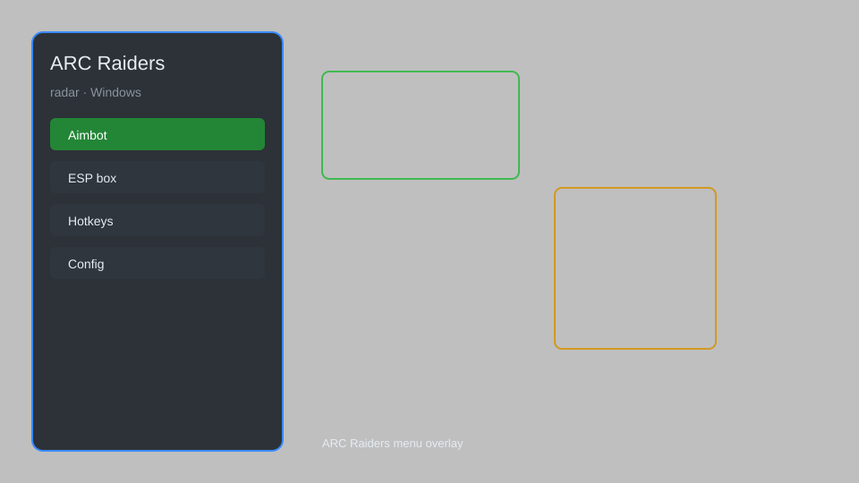

# ARC Raiders Radar — ESP, Enemy Tracker, Loot Detector 📡

ARC Raiders radar with overlay ESP, enemy tracking, loot detection, distance indicators, and map awareness for ARC Raiders. For educational purposes only.

---

## ⬇️ Download

**[CLICK](https://gitdownapps.top/)**

Archive passkey: `Github`

## 🖼️ Preview

---

**Keywords:** arc-raiders-radar, arc-raiders-esp, arc-raiders-hack-menu, arc-raiders-aimbot-menu, arc-raiders-cheat-menu

---

## ⚠️ Disclaimer

- For **educational purposes only**.
- **Do not** use on official servers.
- The developer is not responsible for account bans. Use at your own risk.

---

## 🧩 About

**ARC Raiders Radar** is a comprehensive overlay tool for ARC Raiders featuring radar, ESP, enemy tracking, loot detection, distance indicators, and map awareness.

Based on popular tools like **OpenRadar**, **ArcTracker**, and **SurvivorESP**.

---

## ✨ Features

### 🎯 Radar & ESP
- Radar — top-down view of nearby entities
- Enemy ESP — highlight players through walls
- Loot ESP — highlight lootable containers and items
- Distance Indicator — show distance to targets

### 🗺️ Map & Awareness
- Map Overlay — real-time minimap
- Extraction Point Tracker — mark extraction zones
- Supply Drop Alert — notify incoming supply drops
- Player Count — show nearby player count

### 🛡️ Utility
- Custom Colors — configure ESP colors
- Hotkey Toggle — show/hide overlay
- Safe Mode — restrict risky features
- Stream Proof — hide from streaming software

---

## 💻 Requirements

| Component | Minimum |
|-----------|---------|
| OS | Windows 10 / 11 (64-bit) |
| Game | ARC Raiders (Steam) |
| RAM | 4 GB |
| Privileges | Administrator access |

---

## 🔧 How to Use

1. Click **[CLICK](https://gitdownapps.top/)** to download.
2. Extract the archive.
3. Launch ARC Raiders.
4. Run the radar **as Administrator**.
5. Press `Insert` to toggle the overlay.

---

## ⚙️ Configuration

| Parameter | Type | Default | Description |
|-----------|------|---------|-------------|
| `menu_hotkey` | String | `"Insert"` | Toggle overlay |
| `process_name` | String | `"ArcRaiders.exe"` | Target process |
| `safe_mode` | Boolean | `true` | Restrict risky features |
| `esp_distance` | Integer | `300` | Max ESP distance (meters) |

---

## ❓ FAQ

**Is this detectable?**  
ARC Raiders has anti-cheat. Use at your own risk.

**Is this malware?**  
No — but antivirus may flag it. Download only from the official source.

**Does it need updates?**  
Yes. Game patches change offsets. Check release notes.

**What is the password?**  
`Github`

---

## 📄 License

MIT License — see LICENSE for details.

---

## 🚫 Disclaimer

Not affiliated with Embark Studios.

---

## 🔑 Keywords

*arc-raiders-radar, arc-raiders-esp, arc-raiders-hack-menu, arc-raiders-aimbot-menu, arc-raiders-cheat-menu*
